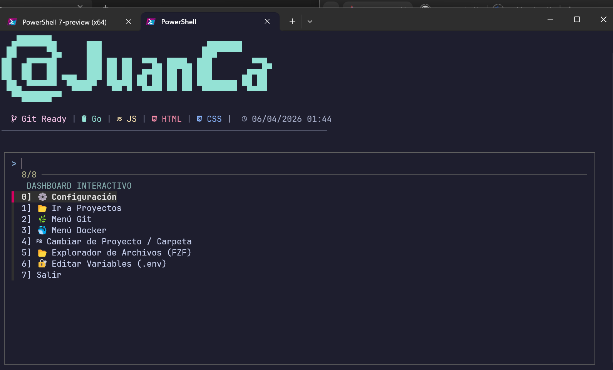

# 🚀 DevDashboard v1.0.1
> Entorno CLI interactivo para PowerShell 7+ personalizado para @JuanCa.



## ✨ Características
- **Dashboard Interactivo:** Acceso rápido a proyectos, Docker y Git.
- **Explorador "Oil" (FZF):** Navegación ultra rápida con preview de archivos mediante `bat`.
- **Git Workflow:** Menús integrados para Stash, Commit y Diff detallado.
- **Arquitectura Modular:** Separación en carpetas `Public` y `Private`.

## 🛠️ Requisitos
- **PowerShell 7.0+**
- **Nerd Fonts** (Recomendado: JetBrainsMono Nerd Font)
- **Herramientas:** `fzf`, `bat`, `nvim`, `rg`, `git`.

## 📥 Instalación
Clona este repositorio:
```PowerShell
git clone https://github.com/juanca0423/DevDashboard.git
```

Ejecuta el instalador:
```PowerShell
./install.ps1
```
---

## 🛠️ Funciones Principales (v1.1.0)

El módulo se divide en comandos rápidos accesibles mediante el motor de autocompletado `dsh`.

### 🐳 Gestión de Docker
- **`Start-DockerEnv`**: Levanta los contenedores del proyecto actual (`docker-compose up --build`).
- **`Stop-DockerEnv`**: Detiene y remueve los contenedores (`docker-compose down`).
- **`Enter-App` / `Enter-DB`**: Acceso directo a la terminal interactiva del contenedor de la aplicación o la base de datos PostgreSQL.
- **`Get-ContainerLog`**: Visualización de logs en tiempo real con seguimiento (`-f`).

### 🌿 Herramientas de Git
- **`Show-GitAll`**: Flujo de trabajo rápido que ejecuta `add .`, `commit -m` (con prompt para mensaje) y `push`.
- **`Switch-GitBranch`**: Selector visual de ramas utilizando **FZF**.
- **`Get-GitLog`**: Historial de commits interactivo para inspección rápida.
- **`Restore-GitStash` / `Remove-GitStash`**: Gestión simplificada de cambios temporales en el stack de Git.

### 🔍 Búsqueda y Navegación
- **`Get-Grep`**: Búsqueda global de texto ultra rápida utilizando **Ripgrep** integrado con **FZF**.
- **`Get-GoSymbols` / `Get-PySymbols`**: Buscadores específicos de símbolos (funciones, estructuras, variables) para lenguajes específicos.
- **`Show-NavExplorer-fzf`**: Explorador de archivos interactivo para saltar entre directorios sin usar `cd` manualmente.

### 🖥️ Sistema y Dashboard
- **`dash` / `Show-Dashboard`**: Abre el panel visual interactivo con menús categorizados.
- **`dsh [comando]`**: Punto de entrada único con autocompletado inteligente para ejecutar cualquier función del módulo.
- **`New-Repo`**: Genera una estructura de carpetas estandarizada para nuevos proyectos de desarrollo en GO, JavaScript, CSS, Handlebars.

---

## **"Cómo usar el autocompletado"**

> [!TIP] Pro-Tip:
> Escribe `dsh` seguido de un espacio y presiona `<Tab>` veras la lista vertical de comandos con iconos y descripciones detalladas.

